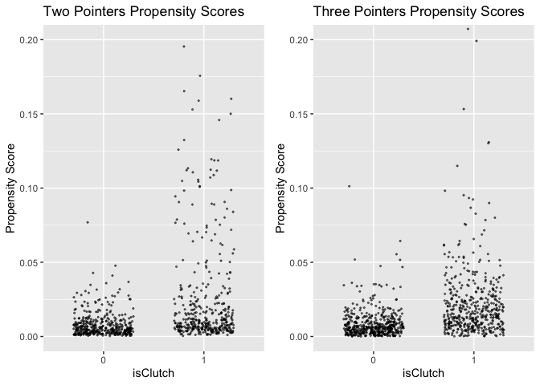
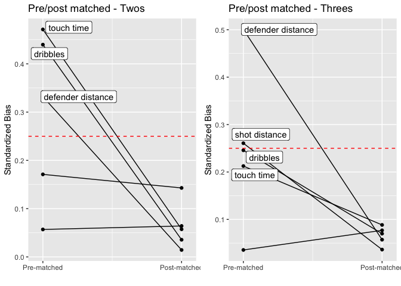

The Causal Impacts of ‘Clutch’ Situations on NBA Shooting Percentages
================
Alexander Hinton

### Background

Based on the perceived ability to perform in the most important
situations, fans, media members and players alike love to use the term
`clutch` to describe certain players. While highlight reels and biased
memories may make it seem like our favourite players always deliver when
the game is on the line, the reality is much different. A recent
[article by Seth
Partnow](https://theathletic.com/1142773/2019/08/20/the-clutch-factor-analyzing-hero-shots-in-the-nba/)
showed that the average shooting percentage in `clutch` situations was
only around , much lower than the conversion rate across all shot types.
Even players widely considered to be “clutch”, such as Kobe Bryant, had
clutch shooting percentages right around this
 mark.
The natural follow up question which arises is what makes these shots
have such a low conversion rate. There are two main drivers which I
hypothesize:

  - Shots taken in these clutch situations are simply very difficult
    shots on average, in terms of defensive pressure and distance from
    the basket.
  - The intensity of the situation, with the crowd standing on their
    feet, and the increased adrenaline causing faster heartrates and
    sweaty palms causes players to be less accurate in their shooting. 
    Of course, a combination of these two effects is also possible. 

I aim to use matching techniques to perform a causal inference based
analysis to determine whether there is in fact a causal impact of clutch
situations reducing shooting percentage in the NBA, beyond simply taking
more difficult shots.

#### Defining clutch

Before continuing, the definition of what constitutes a clutch shot in
this analysis needs to be established, as this term is inherently
subject. I delegated any shot in the last
" of a game, where
the score was within 
points (a one possession game) as a clutch shot, which is similar to the
definition used by Partnow in the article referenced above. These are
the shots where a timeout will often be taken beforehand, the crowd is
all on their feet, and the nerves would be at their peak.

In terms of causal inference lingo, the `treatment` group will be these
shot attempts which were taken in the clutch situations, while the
`control` group will be all shot attempts outside of these situations,
where the stakes and pressure of the moment are significantly less on
average.

<!-- In order to isolate potential causal impacts I will use propensity score matching, as well as a more handpicked case-control matching strategy to find pairs of shots deemed to be very similar, with the difference being whether each shot was in a clutch situation or not. -->

#### Gathering data

In order to estimate a potential causal impact of the clutch situation
on shooting accuracy, the difficulty of the shot must be controlled for.
This requires quite granular data about each shot attempt. Fortunately,
the website [NBA-savant](https://www.nbasavant.com/) provides detailed
data on all NBA shots, including shot distance, distance to the closest
defender, name of the closest defender, number of dribbles before the
shot, etc. Unfortunately, the NBA stopped making this data public in
January 2016, meaning the most recent NBA seasons could not be used in
this analysis. I used all regular season shots from the 2013-2014
season, 2014-2015 season, and the 2015-2016 season until the granular
shot data stopped being released.  

While game clock information was available from the shot data, the score
at the time the shot was taken was not. Using my definition of clutch
from above, this score information is required. This info was gathered
by merging the shot data with play-by-play data, and adding in the
current score information which was unavailable in the shot charts.

<!-- Approximately $80\%$ of shots were able to matched with shot events in the play by play data (small discrepancies in game clock at the time of shot meant not all shots were matched).  -->

Once I had gathered the shot information I separated shots into four
categories: clutch and non-clutch twos, and clutch and non-clutch
threes. For two pointers, I only included shots that were from at least
 feet, as I wanted to
be comparing jumpers, and did not think the same clutch effect would
apply to lay-ups, dunks, put-backs etc. The control group of non-clutch
shots consisted of any shot taken in the first three quarters of a game.
I considered lumping all shot types together in order to increase sample
sizes, but thought that if there truly is a crunch time, or clutch
effect on shooting accuracy it may not be the same between two pointers
and three pointers, and they should be treated separately.  Before
diving into the causal inference approaches, it’s important to have an
idea what the data looks like.

#### Summary stats

<table class="table" style="margin-left: auto; margin-right: auto;">

<caption>

Summary Stats: Averages for Clutch and Non-Clutch Two Point Shots

</caption>

<thead>

<tr>

<th style="text-align:right;">

isClutch

</th>

<th style="text-align:right;">

FG percentage

</th>

<th style="text-align:right;">

Defender Height

</th>

<th style="text-align:right;">

Dribbles

</th>

<th style="text-align:right;">

Touch time

</th>

<th style="text-align:right;">

Shot Distance

</th>

<th style="text-align:right;">

Defender Distance

</th>

<th style="text-align:right;">

Count

</th>

</tr>

</thead>

<tbody>

<tr>

<td style="text-align:right;">

0

</td>

<td style="text-align:right;">

40.3

</td>

<td style="text-align:right;">

79.0

</td>

<td style="text-align:right;">

2.4

</td>

<td style="text-align:right;">

3.1

</td>

<td style="text-align:right;">

16.3

</td>

<td style="text-align:right;">

4.7

</td>

<td style="text-align:right;">

83351

</td>

</tr>

<tr>

<td style="text-align:right;">

1

</td>

<td style="text-align:right;">

23.8

</td>

<td style="text-align:right;">

78.6

</td>

<td style="text-align:right;">

6.0

</td>

<td style="text-align:right;">

6.5

</td>

<td style="text-align:right;">

16.9

</td>

<td style="text-align:right;">

3.9

</td>

<td style="text-align:right;">

408

</td>

</tr>

</tbody>

</table>

<table class="table" style="margin-left: auto; margin-right: auto;">

<caption>

Summary Stats: Averages for Clutch and Non-Clutch Three Point Shots

</caption>

<thead>

<tr>

<th style="text-align:right;">

isClutch

</th>

<th style="text-align:right;">

FG percentage

</th>

<th style="text-align:right;">

Defender Height

</th>

<th style="text-align:right;">

Dribbles

</th>

<th style="text-align:right;">

Touch time

</th>

<th style="text-align:right;">

Shot Distance

</th>

<th style="text-align:right;">

Defender Distance

</th>

<th style="text-align:right;">

Count

</th>

</tr>

</thead>

<tbody>

<tr>

<td style="text-align:right;">

0

</td>

<td style="text-align:right;">

35.8

</td>

<td style="text-align:right;">

78

</td>

<td style="text-align:right;">

1.0

</td>

<td style="text-align:right;">

1.8

</td>

<td style="text-align:right;">

24.8

</td>

<td style="text-align:right;">

6.1

</td>

<td style="text-align:right;">

75186

</td>

</tr>

<tr>

<td style="text-align:right;">

1

</td>

<td style="text-align:right;">

22.7

</td>

<td style="text-align:right;">

78

</td>

<td style="text-align:right;">

2.2

</td>

<td style="text-align:right;">

2.7

</td>

<td style="text-align:right;">

26.7

</td>

<td style="text-align:right;">

4.6

</td>

<td style="text-align:right;">

484

</td>

</tr>

</tbody>

</table>

There are some pretty stark differences in shooting percentages between
non-clutch and clutch shots for both two pointers and three pointers.
However, we are clearly not comparing apples to apples in terms of shot
difficulty. For both two pointers and three pointers, the average clutch
shot attempt is from farther away, has a closer defender and is off the
back of a longer individual effort (more dribbles and a longer touch
time). These in total make it obvious that average clutch shot attempts
on average are much harder than non clutch attempts, and cannot be
compared directly. A strategy to account for the difficulty of a shot is
needed in order to make a fair comparison between a clutch shot and a
non-clutch shot when trying to estimate a causal impact of the clutch
situation on shooting accuracy.

#### Causal Inference in Observational Studies

In an ideal world, randomized control trials are used to estimate the
causal impact of a treament. In these situations, the treatment of
interest is randomly allocated to the observational units (often people)
in the study. Some outcome measure is calculated for both the treatment
and control groups, and the difference in this outcome between groups is
used as an estimate of the efficacy of the treatment. Due to the
randomized nature of treatment assignment, the chance of biased
estimates due to confounding is minimized.  In situations where a
randomized controlled trial is possible, observational studies can
sometimes be used to estimate causal treatment effects. The main
drawback and danger when using observational studies for causal
inference is the potential for biased estimates due to confounding. In
an observational study, treatment assignments have not been done
randomly, which can be a problem if there are variables associated with
both the treatment assignment and the outcome variable, which are known
as confounders. For example, in a study looking at the effectiveness of
eating vegetables on health outcomes it would be naive to simply compare
the outcomes of individuals eating veggie rich diets versus those who
are not, as the individuals eating more veggies may also be excercising
more, maybe have higher incomes, and these would both be correlated with
higher health outcomes. This potential bias in estimates due to
confounding variables is the main difficulty of performing causal
inference on observational studies where treatments have not been
explicitly assigned.

#### Matching strategies to estimate causal impacts

Matching strategies are often used in an attempt to mimic a randomized
experiment when using observational data. In matching studies,
observations which received the treatment are carefully matched with
observations in the control group such that the treatment and control
group have similar covariate distributions.

In this analysis the treatment group (the clutch shots), clearly have
different levels for many of the covariates of interest than the control
groups (the non clutch shots). As seen above, defender distance, number
of dribbles, touch time, etc. are all different between the treatment
group levels at least in their mean levels.

I attempted two different matching strategies in order to estimate a
causal effect, the first was an exact matching approach, and the second
was matching using propensity scores. In both cases I attempted to match
each clutch shot to a non-clutch shot, which means the effect I am
looking for is known is called the Average Treatment effect on the
Treated (ATT).

In the exact matching, I considered the following covariates to be
important when quantifying the difficulty of a shot: shot distance,
defender distance, defender, number of dribbles, and touch time. For
each clutch shot, I attempted to find a shot in the non-clutch dataframe
which would match on:

  - `name`: must be the same shooter
  - `season`: must be in the same season
  - `shot distance`: +/- 1 foot
  - `defender distance`, +/- 0.5 feet
  - `number of dribbles`, +/- 1
  - `touch time`, +/- 0.5 seconds
  - `defender height`, +/- 1 inch (Note: matching explicitly on who was
    the defender made the results very sparse, so I instead calculated
    the height of the closest defender, and matched on defender height.
    While not exact, I think matching on the distance to the closest
    defender plus the height of the defender should capture the degree
    the shot was contested pretty well.
  - `shot type`: In the play-by-play data, a shot can be classified as a
    “jump shot”, “fadeaway jump shot” etc., so I also matched on
    shot-type to control for difficulty.

All told, of the 484 clutch three point shot attempts identified and 408
clutch two point attempts, 170 of the threes, but only 70 of the two
point attempts could be matched to a non-clutch shot attempt using this
rigid matching criteria.

*Note*: if more than 1 non-clutch shot matched, I would randomly select
one as the matching shot.

#### Summary stats - exact matching

<table class="table" style="margin-left: auto; margin-right: auto;">

<caption>

Matched 2 pointers

</caption>

<thead>

<tr>

<th style="text-align:right;">

isClutch

</th>

<th style="text-align:right;">

FG percentage

</th>

<th style="text-align:right;">

Defender Height

</th>

<th style="text-align:right;">

Dribbles

</th>

<th style="text-align:right;">

Touch time

</th>

<th style="text-align:right;">

Shot Distance

</th>

<th style="text-align:right;">

Defender Distance

</th>

<th style="text-align:right;">

Count

</th>

</tr>

</thead>

<tbody>

<tr>

<td style="text-align:right;">

0

</td>

<td style="text-align:right;">

35.7

</td>

<td style="text-align:right;">

79.5

</td>

<td style="text-align:right;">

1.9

</td>

<td style="text-align:right;">

2.6

</td>

<td style="text-align:right;">

17.2

</td>

<td style="text-align:right;">

4.2

</td>

<td style="text-align:right;">

70

</td>

</tr>

<tr>

<td style="text-align:right;">

1

</td>

<td style="text-align:right;">

21.4

</td>

<td style="text-align:right;">

79.4

</td>

<td style="text-align:right;">

1.9

</td>

<td style="text-align:right;">

2.5

</td>

<td style="text-align:right;">

17.3

</td>

<td style="text-align:right;">

4.1

</td>

<td style="text-align:right;">

70

</td>

</tr>

</tbody>

</table>

<table class="table" style="margin-left: auto; margin-right: auto;">

<caption>

Matched 3 pointers

</caption>

<thead>

<tr>

<th style="text-align:right;">

isClutch

</th>

<th style="text-align:right;">

FG percentage

</th>

<th style="text-align:right;">

Defender Height

</th>

<th style="text-align:right;">

Dribbles

</th>

<th style="text-align:right;">

Touch time

</th>

<th style="text-align:right;">

Shot Distance

</th>

<th style="text-align:right;">

Defender Distance

</th>

<th style="text-align:right;">

Count

</th>

</tr>

</thead>

<tbody>

<tr>

<td style="text-align:right;">

0

</td>

<td style="text-align:right;">

34.7

</td>

<td style="text-align:right;">

77.7

</td>

<td style="text-align:right;">

0.4

</td>

<td style="text-align:right;">

1.3

</td>

<td style="text-align:right;">

24.6

</td>

<td style="text-align:right;">

4.9

</td>

<td style="text-align:right;">

170

</td>

</tr>

<tr>

<td style="text-align:right;">

1

</td>

<td style="text-align:right;">

25.9

</td>

<td style="text-align:right;">

77.8

</td>

<td style="text-align:right;">

0.5

</td>

<td style="text-align:right;">

1.2

</td>

<td style="text-align:right;">

24.6

</td>

<td style="text-align:right;">

4.8

</td>

<td style="text-align:right;">

170

</td>

</tr>

</tbody>

</table>

We can see that the exact matching procedure has done it’s job, as the
average levels of the covariates are almost identical between clutch and
non clutch shots. What is interesting is that even after controlling for
shot difficulty based on the observed covariates, the shooting
percentages of the clutch shots are about

lower than the non-clutch shot attempts. The next step is to estimate a
logistic regression model to see if these differences are statistically
significant. Note that matching and controlling for covariates (another
approach to isolate causal effects) do not have to be independent
methods, but work best in tandem. So in the logistic regression model,
the dependent variable is whether the shot was made, while the
independent variables are the indicator variable of whether a shot was
clutch or not (our Treatment) plus all the other control variables.

#### Logistic regression model results

<table class="table" style="margin-left: auto; margin-right: auto;">

<caption>

Model Parameters for two point shots

</caption>

<thead>

<tr>

<th style="text-align:left;">

term

</th>

<th style="text-align:right;">

estimate

</th>

<th style="text-align:right;">

std.error

</th>

<th style="text-align:right;">

statistic

</th>

<th style="text-align:right;">

p.value

</th>

</tr>

</thead>

<tbody>

<tr>

<td style="text-align:left;">

(Intercept)

</td>

<td style="text-align:right;">

1.647

</td>

<td style="text-align:right;">

5.965

</td>

<td style="text-align:right;">

0.276

</td>

<td style="text-align:right;">

0.782

</td>

</tr>

<tr>

<td style="text-align:left;font-weight: bold;">

isClutch

</td>

<td style="text-align:right;font-weight: bold;">

\-0.669

</td>

<td style="text-align:right;font-weight: bold;">

0.394

</td>

<td style="text-align:right;font-weight: bold;">

\-1.697

</td>

<td style="text-align:right;font-weight: bold;">

0.090

</td>

</tr>

<tr>

<td style="text-align:left;">

shot\_distance

</td>

<td style="text-align:right;">

\-0.034

</td>

<td style="text-align:right;">

0.075

</td>

<td style="text-align:right;">

\-0.451

</td>

<td style="text-align:right;">

0.652

</td>

</tr>

<tr>

<td style="text-align:left;">

defender\_height

</td>

<td style="text-align:right;">

\-0.035

</td>

<td style="text-align:right;">

0.076

</td>

<td style="text-align:right;">

\-0.465

</td>

<td style="text-align:right;">

0.642

</td>

</tr>

<tr>

<td style="text-align:left;">

dribbles

</td>

<td style="text-align:right;">

\-0.496

</td>

<td style="text-align:right;">

0.312

</td>

<td style="text-align:right;">

\-1.589

</td>

<td style="text-align:right;">

0.112

</td>

</tr>

<tr>

<td style="text-align:left;">

touch\_time

</td>

<td style="text-align:right;">

0.439

</td>

<td style="text-align:right;">

0.356

</td>

<td style="text-align:right;">

1.233

</td>

<td style="text-align:right;">

0.217

</td>

</tr>

<tr>

<td style="text-align:left;">

defender\_distance

</td>

<td style="text-align:right;">

0.213

</td>

<td style="text-align:right;">

0.142

</td>

<td style="text-align:right;">

1.503

</td>

<td style="text-align:right;">

0.133

</td>

</tr>

</tbody>

</table>

<table class="table" style="margin-left: auto; margin-right: auto;">

<caption>

Model Parameters for three point shots

</caption>

<thead>

<tr>

<th style="text-align:left;">

term

</th>

<th style="text-align:right;">

estimate

</th>

<th style="text-align:right;">

std.error

</th>

<th style="text-align:right;">

statistic

</th>

<th style="text-align:right;">

p.value

</th>

</tr>

</thead>

<tbody>

<tr>

<td style="text-align:left;">

(Intercept)

</td>

<td style="text-align:right;">

\-1.149

</td>

<td style="text-align:right;">

4.083

</td>

<td style="text-align:right;">

\-0.281

</td>

<td style="text-align:right;">

0.778

</td>

</tr>

<tr>

<td style="text-align:left;font-weight: bold;">

isClutch

</td>

<td style="text-align:right;font-weight: bold;">

\-0.371

</td>

<td style="text-align:right;font-weight: bold;">

0.243

</td>

<td style="text-align:right;font-weight: bold;">

\-1.527

</td>

<td style="text-align:right;font-weight: bold;">

0.127

</td>

</tr>

<tr>

<td style="text-align:left;">

shot\_distance

</td>

<td style="text-align:right;">

0.114

</td>

<td style="text-align:right;">

0.103

</td>

<td style="text-align:right;">

1.112

</td>

<td style="text-align:right;">

0.266

</td>

</tr>

<tr>

<td style="text-align:left;">

defender\_height

</td>

<td style="text-align:right;">

\-0.042

</td>

<td style="text-align:right;">

0.042

</td>

<td style="text-align:right;">

\-0.989

</td>

<td style="text-align:right;">

0.323

</td>

</tr>

<tr>

<td style="text-align:left;">

dribbles

</td>

<td style="text-align:right;">

\-0.500

</td>

<td style="text-align:right;">

0.340

</td>

<td style="text-align:right;">

\-1.470

</td>

<td style="text-align:right;">

0.141

</td>

</tr>

<tr>

<td style="text-align:left;">

touch\_time

</td>

<td style="text-align:right;">

0.510

</td>

<td style="text-align:right;">

0.390

</td>

<td style="text-align:right;">

1.307

</td>

<td style="text-align:right;">

0.191

</td>

</tr>

<tr>

<td style="text-align:left;">

defender\_distance

</td>

<td style="text-align:right;">

0.104

</td>

<td style="text-align:right;">

0.058

</td>

<td style="text-align:right;">

1.787

</td>

<td style="text-align:right;">

0.074

</td>

</tr>

</tbody>

</table>

As expected based on the summary stats of the matched data, the estimate
associated with the `isClutch` parameter is negative. Clutch shot
attempts are estimated to have odds of success only
 (twos) or
 (threes) times
the odds of success for their corresponding non-clutch shot attempts,
holding all other covariates constant. Interestingly and a bit
surprisingly, while there was a large difference in field goal
percentage between clutch and non-clutch shot attempts even in the
matched dataframe, the effect is not statistically significant at the

significance level for both two point shots and three point shots, which
is perhaps due to the reduced sample sizes.  

### Propensity score matching

Exact matching approaches like the one used above struggle with
situations where there are many observed covariates as it becomes very
difficult to find exact matches for each treated unit, and so sample
sizes are greatly reduced. This difficulty has spurred on the use of
what are known as propensity scores for matching purposes. In propensity
score matching, the matching is done via the use of a statistical
modelling instead of the rule based matching done above. The first step
in the process is to perform logistic regression (or any other binary
classifier which can output probabilities), with the treatment level
(`isClutch`) as the dependent variable, and the covariates as the
independent variables. The outputs of this regression are the estimated
probabilitities that each observation is a clutch shot. After this
estimation, we can then match each clutch shot to a non-clutch shot, not
explicitly on each covariate value as was done above, but on the
probability that each shot was clutch, given it’s covariate levels. In
this way the distribution of covariates should be very similar between
the matched clutch and non clutch groups.

#### Fit the propensity score model

Before fitting the model, we need to filter down our non clutch shots,
on account of an important notion in causal inference known as
positivity. Basically, what `Positivity` means is that we only look for
causal impacts on observations/individuals who potentially could have
received either treatment value - which in our case means players who
take both clutch and non clutch shots. I can think of many players who
are very unlikely to ever take a clutch shot, as these are almost always
taken by the best players on a team. In light of this, I only consider
non-clutch shots from players who have also taken at least one clutch
shot in the propensity score modelling. This process removes about one
third of all the non-clutch shots.

The covariates I will consider in the model will be the same ones as
were considered for the matching experiment above:

  - `Name` of shooter
  - `Defender height`
  - `shot distance`
  - `defender distance`
  - `dribbles`
  - `touch time`

#### Summary stats - with propensity scores

<table class="table" style="margin-left: auto; margin-right: auto;">

<caption>

Summary Stats for ‘Positive’ Threes

</caption>

<thead>

<tr>

<th style="text-align:right;">

isClutch

</th>

<th style="text-align:right;">

FG percentage

</th>

<th style="text-align:right;">

Defender Height

</th>

<th style="text-align:right;">

Dribbles

</th>

<th style="text-align:right;">

Touch time

</th>

<th style="text-align:right;">

Shot Distance

</th>

<th style="text-align:right;">

Defender Distance

</th>

<th style="text-align:right;">

propensity\_score

</th>

<th style="text-align:right;">

Count

</th>

</tr>

</thead>

<tbody>

<tr>

<td style="text-align:right;">

0

</td>

<td style="text-align:right;">

36.4

</td>

<td style="text-align:right;">

77.8

</td>

<td style="text-align:right;">

1.1

</td>

<td style="text-align:right;">

1.9

</td>

<td style="text-align:right;">

24.8

</td>

<td style="text-align:right;">

6.0

</td>

<td style="text-align:right;">

0.0090

</td>

<td style="text-align:right;">

52324

</td>

</tr>

<tr>

<td style="text-align:right;">

1

</td>

<td style="text-align:right;">

22.7

</td>

<td style="text-align:right;">

78.0

</td>

<td style="text-align:right;">

2.2

</td>

<td style="text-align:right;">

2.7

</td>

<td style="text-align:right;">

26.7

</td>

<td style="text-align:right;">

4.6

</td>

<td style="text-align:right;">

0.0303

</td>

<td style="text-align:right;">

484

</td>

</tr>

</tbody>

</table>

<table class="table" style="margin-left: auto; margin-right: auto;">

<caption>

Summary Stats for ‘Positive’ Twos

</caption>

<thead>

<tr>

<th style="text-align:right;">

isClutch

</th>

<th style="text-align:right;">

fg\_percentage

</th>

<th style="text-align:right;">

defender\_height

</th>

<th style="text-align:right;">

dribbles

</th>

<th style="text-align:right;">

touch\_time

</th>

<th style="text-align:right;">

shot\_dist

</th>

<th style="text-align:right;">

defend\_dist

</th>

<th style="text-align:right;">

propensity\_score

</th>

<th style="text-align:right;">

n

</th>

</tr>

</thead>

<tbody>

<tr>

<td style="text-align:right;">

0

</td>

<td style="text-align:right;">

41.3

</td>

<td style="text-align:right;">

78.8

</td>

<td style="text-align:right;">

2.7

</td>

<td style="text-align:right;">

3.5

</td>

<td style="text-align:right;">

16.3

</td>

<td style="text-align:right;">

4.6

</td>

<td style="text-align:right;">

0.0076

</td>

<td style="text-align:right;">

51954

</td>

</tr>

<tr>

<td style="text-align:right;">

1

</td>

<td style="text-align:right;">

23.8

</td>

<td style="text-align:right;">

78.6

</td>

<td style="text-align:right;">

6.0

</td>

<td style="text-align:right;">

6.5

</td>

<td style="text-align:right;">

16.9

</td>

<td style="text-align:right;">

3.9

</td>

<td style="text-align:right;">

0.0293

</td>

<td style="text-align:right;">

408

</td>

</tr>

</tbody>

</table>

The average propensity score for the clutch shots was more than three
times higher for clutch three point shots, and about four times higher
for clutch two point shots than the average propensity scores for the
non clutch twos. This basically just means the distributions of the
clutch and non-clutch shots are different in terms of the covariates,
which we already knew. The reason the propensity scores (or predicted
probabilities of being a clutch shot) are so low is because there are so
many more non-clutch shots in the sample than clutch shots, but the
important thing is the large relative difference between the two groups.
Next we will match observations in the treated group with the closest
observation in the control group by looking at propensity scores.

<!-- -->

  - Note that this plot has only a random sample of the non-clutch shots
    for visualization purposes.

Looking at the scatter plots of propensity scores for clutch and
non-clutch shots, it’s clear that almost all the non clutch shots had
propensity scores close to , while there was a much wider distribution of propensity scores for
the clutch shots. The matching process now is quite intuitive, for each
shot in the clutch subset, we will find the shot in the non-clutch
subset that is closest in terms of propensity scores. This does not mean
the exact levels of each covariate are the same like in the brute force
matching above, but it means that the probability that two shots were
assigned the treatment is the same, conditional on their covariate
levels. Some clutch shots appear to have propensity scores which are
well above all of the non-clutch shots, so we will set a minimum
threshold to determine how close two different observations need to be
for matching purposes.

##### Propensity matching

After matching based on propensity scores but before moving on to the
final modelling stage, we need to do some inspection of the matched sets
to insure that the procedure has made the control and treatment groups
sufficiently similar in their covariate levels. A more formal check is
done below based on the standardized bias of each covariate, but the
first thing I like to do is a manual check.

<table class="table" style="margin-left: auto; margin-right: auto;">

<caption>

Summary Stats of Two Pointers After Propensity Score Matching

</caption>

<thead>

<tr>

<th style="text-align:right;">

isClutch

</th>

<th style="text-align:right;">

FG percentage

</th>

<th style="text-align:right;">

Defender Height

</th>

<th style="text-align:right;">

Dribbles

</th>

<th style="text-align:right;">

Touch time

</th>

<th style="text-align:right;">

Shot Distance

</th>

<th style="text-align:right;">

Defender Distance

</th>

<th style="text-align:right;">

propensity\_score

</th>

<th style="text-align:right;">

Count

</th>

</tr>

</thead>

<tbody>

<tr>

<td style="text-align:right;">

0

</td>

<td style="text-align:right;">

40.3

</td>

<td style="text-align:right;">

78.8

</td>

<td style="text-align:right;">

5.8

</td>

<td style="text-align:right;">

6.4

</td>

<td style="text-align:right;">

16.4

</td>

<td style="text-align:right;">

4.0

</td>

<td style="text-align:right;">

0.0235

</td>

<td style="text-align:right;">

395

</td>

</tr>

<tr>

<td style="text-align:right;">

1

</td>

<td style="text-align:right;">

23.8

</td>

<td style="text-align:right;">

78.6

</td>

<td style="text-align:right;">

5.6

</td>

<td style="text-align:right;">

6.0

</td>

<td style="text-align:right;">

16.8

</td>

<td style="text-align:right;">

3.9

</td>

<td style="text-align:right;">

0.0235

</td>

<td style="text-align:right;">

395

</td>

</tr>

</tbody>

</table>

<table class="table" style="margin-left: auto; margin-right: auto;">

<caption>

Summary Stats of Three Pointers After Propensity Score Matching

</caption>

<thead>

<tr>

<th style="text-align:right;">

isClutch

</th>

<th style="text-align:right;">

FG percentage

</th>

<th style="text-align:right;">

Defender Height

</th>

<th style="text-align:right;">

Dribbles

</th>

<th style="text-align:right;">

Touch time

</th>

<th style="text-align:right;">

Shot Distance

</th>

<th style="text-align:right;">

Defender Distance

</th>

<th style="text-align:right;">

propensity\_score

</th>

<th style="text-align:right;">

Count

</th>

</tr>

</thead>

<tbody>

<tr>

<td style="text-align:right;">

0

</td>

<td style="text-align:right;">

32.8

</td>

<td style="text-align:right;">

78.2

</td>

<td style="text-align:right;">

2.5

</td>

<td style="text-align:right;">

3.1

</td>

<td style="text-align:right;">

26.3

</td>

<td style="text-align:right;">

4.8

</td>

<td style="text-align:right;">

0.0223

</td>

<td style="text-align:right;">

472

</td>

</tr>

<tr>

<td style="text-align:right;">

1

</td>

<td style="text-align:right;">

23.1

</td>

<td style="text-align:right;">

78.0

</td>

<td style="text-align:right;">

2.2

</td>

<td style="text-align:right;">

2.8

</td>

<td style="text-align:right;">

26.5

</td>

<td style="text-align:right;">

4.6

</td>

<td style="text-align:right;">

0.0223

</td>

<td style="text-align:right;">

472

</td>

</tr>

</tbody>

</table>

As we have not matched explicitly on each covariate, we can see some
differences in some mean covariate levels between the two groups. We
also see the massive benefit of using this procedure in that sample
sizes can now be much larger, relative to the exact matching procedure
above. Let’s now check the standardized bias of each covariate, which is
a ratio of the differences in mean covariate levels between the
treatment and control group, divided by the standard deviation of the
treatment group.
. The maximum standardized
bias for any covariate should be nor more than
 to ensure that
the matched groups are similar enough to perform valid inference.

<!-- -->

For both the two and three pointers the standardized bias for all
covariates is below 0.25, indicating that are matched groups have
similar enough covariate distributions to perform valid causal
inference. The next step is to estimate a logistic regression model in
the same form as was done above after the brute force matching, with
whether the shot is made as the dependent variable, and the treatment
group (isClutch) as well as all other covariates as the independent
variables.

#### Logistic regression model results

<table class="table" style="margin-left: auto; margin-right: auto;">

<caption>

Model Parameters for two point shots

</caption>

<thead>

<tr>

<th style="text-align:left;">

term

</th>

<th style="text-align:right;">

estimate

</th>

<th style="text-align:right;">

std.error

</th>

<th style="text-align:right;">

statistic

</th>

<th style="text-align:right;">

p.value

</th>

</tr>

</thead>

<tbody>

<tr>

<td style="text-align:left;">

(Intercept)

</td>

<td style="text-align:right;">

14.24116

</td>

<td style="text-align:right;">

1455.39892

</td>

<td style="text-align:right;">

0.00979

</td>

<td style="text-align:right;">

0.99219

</td>

</tr>

<tr>

<td style="text-align:left;font-weight: bold;">

isClutch

</td>

<td style="text-align:right;font-weight: bold;">

\-0.83853

</td>

<td style="text-align:right;font-weight: bold;">

0.16420

</td>

<td style="text-align:right;font-weight: bold;">

\-5.10669

</td>

<td style="text-align:right;font-weight: bold;">

0.00000

</td>

</tr>

<tr>

<td style="text-align:left;">

defender\_distance

</td>

<td style="text-align:right;">

0.01014

</td>

<td style="text-align:right;">

0.04563

</td>

<td style="text-align:right;">

0.22220

</td>

<td style="text-align:right;">

0.82416

</td>

</tr>

<tr>

<td style="text-align:left;">

shot\_distance

</td>

<td style="text-align:right;">

0.00706

</td>

<td style="text-align:right;">

0.02711

</td>

<td style="text-align:right;">

0.26058

</td>

<td style="text-align:right;">

0.79441

</td>

</tr>

<tr>

<td style="text-align:left;">

defender\_height

</td>

<td style="text-align:right;">

0.01681

</td>

<td style="text-align:right;">

0.02452

</td>

<td style="text-align:right;">

0.68560

</td>

<td style="text-align:right;">

0.49296

</td>

</tr>

<tr>

<td style="text-align:left;">

dribbles

</td>

<td style="text-align:right;">

0.02016

</td>

<td style="text-align:right;">

0.03583

</td>

<td style="text-align:right;">

0.56266

</td>

<td style="text-align:right;">

0.57367

</td>

</tr>

<tr>

<td style="text-align:left;">

touch\_time

</td>

<td style="text-align:right;">

\-0.04097

</td>

<td style="text-align:right;">

0.04221

</td>

<td style="text-align:right;">

\-0.97067

</td>

<td style="text-align:right;">

0.33171

</td>

</tr>

</tbody>

</table>

<table class="table" style="margin-left: auto; margin-right: auto;">

<caption>

Model Parameters for three point shots

</caption>

<thead>

<tr>

<th style="text-align:left;">

term

</th>

<th style="text-align:right;">

estimate

</th>

<th style="text-align:right;">

std.error

</th>

<th style="text-align:right;">

statistic

</th>

<th style="text-align:right;">

p.value

</th>

</tr>

</thead>

<tbody>

<tr>

<td style="text-align:left;">

(Intercept)

</td>

<td style="text-align:right;">

\-10.59802

</td>

<td style="text-align:right;">

882.74578

</td>

<td style="text-align:right;">

\-0.01201

</td>

<td style="text-align:right;">

0.99042

</td>

</tr>

<tr>

<td style="text-align:left;font-weight: bold;">

isClutch

</td>

<td style="text-align:right;font-weight: bold;">

\-0.46330

</td>

<td style="text-align:right;font-weight: bold;">

0.15162

</td>

<td style="text-align:right;font-weight: bold;">

\-3.05564

</td>

<td style="text-align:right;font-weight: bold;">

0.00225

</td>

</tr>

<tr>

<td style="text-align:left;">

defender\_distance

</td>

<td style="text-align:right;">

0.10574

</td>

<td style="text-align:right;">

0.02876

</td>

<td style="text-align:right;">

3.67607

</td>

<td style="text-align:right;">

0.00024

</td>

</tr>

<tr>

<td style="text-align:left;">

shot\_distance

</td>

<td style="text-align:right;">

\-0.07257

</td>

<td style="text-align:right;">

0.02109

</td>

<td style="text-align:right;">

\-3.44180

</td>

<td style="text-align:right;">

0.00058

</td>

</tr>

<tr>

<td style="text-align:left;">

defender\_height

</td>

<td style="text-align:right;">

\-0.01199

</td>

<td style="text-align:right;">

0.02386

</td>

<td style="text-align:right;">

\-0.50268

</td>

<td style="text-align:right;">

0.61519

</td>

</tr>

<tr>

<td style="text-align:left;">

dribbles

</td>

<td style="text-align:right;">

\-0.06093

</td>

<td style="text-align:right;">

0.06083

</td>

<td style="text-align:right;">

\-1.00148

</td>

<td style="text-align:right;">

0.31659

</td>

</tr>

<tr>

<td style="text-align:left;">

touch\_time

</td>

<td style="text-align:right;">

0.06594

</td>

<td style="text-align:right;">

0.06900

</td>

<td style="text-align:right;">

0.95561

</td>

<td style="text-align:right;">

0.33927

</td>

</tr>

</tbody>

</table>

The estimated effect of `Clutch` shots is similar in the propensity
score matching to the brute force matching, with estimated of odds of a
making a clutch shot being
 (twos) or
 (threes) the
odds of making an equivalent non-clutch shots. However, in this
regression the estimates have more precision based on the much larger
sample size, and are statistically significant at the

significance level. 

#### Discussions

Based on the analysis, it appears there may be a causal impact of
`clutch` situations negatively impacting shooting percentage, even after
accounting for the difficulty of the shot attempt with granular data on
the shot situation and difficulty. However, there still may be
unobservable characteristics of the shots which we have not captured in
our covariates which may be systematically different between the clutch
and non clutch attempts. While we have captured defender distance and
height, it is not possible to estimate defender *effort*, which could
plausibly be much different between an average shot, and an average
clutch shot. Additionally, while we account for closest defender, it’s
possible many of these shots could have had double teams, where the
second defender could still have an impact on shot make probability.
It’s hard to know if these sort of characteristics could be
confounding the results, as they would require optical tracking data to
capture, but it also seems that the mental stress and the body’s
subsequent physiological response in response to the `clutch` situations
may have a negative causal impact on shot making probabilities.

<!-- - Could I have lumped both two point shots and three point shots together? Maybe, as that would have increased the sample sizes and precision of estimates, perhaps leading to statistical significance. I was only including only shots >= 10 feet, so they are all jump shots, and perhaps can all be compared.   -->

<!-- - I debated splitting the data even further and looking at situations when the shot taker is tied or leading the game versus shots when the shot taker is behind. The psychology and pressure associated with shooting to win (in a tied game), versus shooting not to lose (in a game down 2-3 points) may have heterogenous effects on the clutch shot impact on shooting percentage. -->

## References

#### Data

1.  [NBA Savant](https://www.nbasavant.com/)

<!-- end list -->

  - Detailed shot logs, with granular data up until 2016

<!-- end list -->

2.  [Matthew Barlowe NBA
    Database](https://twitter.com/matthew_barlowe?lang=en)

<!-- end list -->

  - Has an Postgres database with 20 years of NBA PBP data as well as
    other stats. Posted online to the masses to message him for anyone
    to get access. Very grateful for this\!

#### Causal Inference ideas

1.  [Mike Lopez
    blog](https://statsbylopez.com/2017/01/04/matching-to-estimate-the-causal-effects-of-firing-an-nfl-coach/)

<!-- end list -->

  - This content was heavily inspired (especially the standardized bias
    stuff) from this blog post by Mike Lopez.

<!-- end list -->

2.  [Causal Kathy blog](https://causalkathy.com/)

<!-- end list -->

  - Multiple interesting causal inference based sports analysis blogs
    which helped guide the direction of this post.

<!-- end list -->

3.  [Matching methods review
    paper](https://www.ncbi.nlm.nih.gov/pmc/articles/PMC2943670/)

<!-- end list -->

  - Great overview of matching and propensity score methods, quite
    approachable as well for self-teaching.
